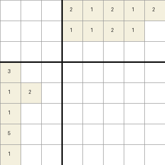

# gym-nonogram

`gym-nonogram` is a small Gymnasium environment for Nonogram puzzles. It is
intended for reinforcement-learning experiments where an agent must infer the
hidden binary grid from row and column clues.


## Motivation

Nonograms are compact logic puzzles with sparse observations, delayed structure,
and a simple action interface. That makes them a useful toy problem for testing
exploration, reward shaping, curriculum learning, and visual demos without a
large simulator.

## Install

```bash
pip install -e .
```

For development and demos:

```bash
pip install -e ".[dev,demo]"
```

For the Stable-Baselines3 example:

```bash
pip install -e ".[dev,demo,sb3]"
```

## Environment spec

The package registers one environment:

```python
import gymnasium as gym
import gym_nonogram

env = gym.make("Nonogram-v0")
```

The default puzzle uses a `5x5` hidden central grid. The observation is an
extended square grid containing the row clues, column clues, and the currently
revealed player grid.

Constructor arguments:

| Argument | Default | Meaning |
| --- | ---: | --- |
| `central_grid_size` | `5` | Width and height of the hidden puzzle grid. |
| `seed` | `0` | Seed used to generate the puzzle. |
| `max_step` | `100` | Maximum number of actions before truncation. |

Reset options:

```python
observation, info = env.reset(options={"central_grid_density": 0.45})
```

`central_grid_density` controls the probability that each hidden cell is filled.

## Observation space

```python
Box(
    low=0,
    high=central_grid_size,
    shape=(extended_grid_size, extended_grid_size),
    dtype=np.int8,
)
```

`extended_grid_size = central_grid_size + central_grid_size // 2 + 1`.

The observation layout is:

```text
+-------------+-------------+
| empty       | column clues|
+-------------+-------------+
| row clues   | player grid |
+-------------+-------------+
```

In the player grid:

| Value | Meaning |
| ---: | --- |
| `0` | Unknown cell. |
| `1` | Player marked the cell as empty. |
| `2` | Player marked the cell as filled. |

## Action space

```python
Tuple(Discrete(size), Discrete(size), Discrete(2))
```

Each action is:

```python
(row, column, value)
```

`value=0` means the agent predicts an empty cell. `value=1` means the agent
predicts a filled cell.

## Rewards

| Case | Reward |
| --- | ---: |
| Correct new prediction | `100` |
| Wrong new prediction | `-20` |
| Already revealed cell | `0` |
| Third wrong prediction | `-100` |
| Full grid with at least one wrong mark | `-100` |
| `max_step` reached | `0` |
| Puzzle completed | `0` |

## Termination logic

An episode terminates when:

- the agent reaches three wrong predictions
- all cells in the central player grid match the hidden solution
- all cells are marked but at least one mark is wrong

An episode is truncated when:

- `max_step` actions have been played

## Examples

Run a random agent:

```bash
python examples/random_agent.py
```

Play manually in the terminal:

```bash
python examples/human_play.py
```

Train a tiny DQN baseline and save a learning curve:

```bash
python examples/train_sb3.py
```

Open the notebook demo:

```bash
jupyter notebook notebooks/nonogram_demo.ipynb
```

The notebook includes board rendering, rollout snapshots, and an animated view
of the environment evolving through actions.



## Demo assets

Generated assets live in `docs/assets/`:

- `board_initial.png`
- `board_rollout_final.png`
- `sample_solved.png`
- `rollout.gif`
- `learning_curve_example.png`

Regenerate them with:

```bash
python scripts/generate_demo_assets.py
```

Benchmark output is written to `docs/benchmark.md`.

## Tests and quality

Run tests:

```bash
pytest -q
```

Run quality checks:

```bash
ruff check .
black --check .
mypy
```

The GitHub Actions workflow runs these checks on Python 3.10, 3.11, and 3.12.

## Current limitations

- The default reward function is intentionally simple.
- Each cell can only be played once; there is no correction action yet.
- Stable-Baselines3 needs a flattened action wrapper because the base environment
  exposes a tuple action space.
